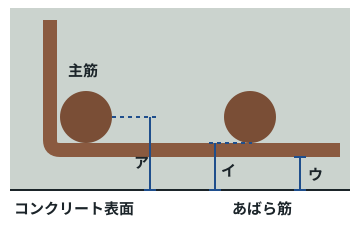
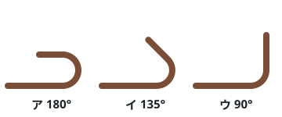
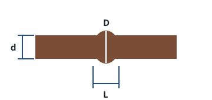

# 模擬テスト 実技（建築区分）（25問・40分）

> 建設分野特定技能2号評価試験の実技（建築区分）を想定し、鉄筋を重点にした練習問題です。
> 合格ラインの目安：75%（1問1点なら 25問中19問）。公式の問題ではありません。
> スマホで自動採点したいときは、同じフォルダの index.html をブラウザで開いてください（使い方は README.md）。

## 問題

### 第1問（鉄筋）

異形（いけい）棒鋼（ぼうこう）の記号（きごう）「SD345」の「345」が表（あらわ）しているものはどれか。

1. 製造（せいぞう）した年（とし）
2. 鉄筋（てっきん）の長（なが）さ（mm）
3. 鉄筋（てっきん）1本（ぽん）の重（おも）さ（kg）
4. 降伏点（こうふくてん）（強（つよ）さ）の下限（かげん）の値（あたい）（N/mm²）

### 第2問（鉄筋）

鉄筋（てっきん）の呼（よ）び名（な）「D13」について、正（ただ）しいものはどれか。

1. 長（なが）さが13mである。
2. 13本（ぼん）の束（たば）である。
3. 異形（いけい）棒鋼（ぼうこう）で、公称（こうしょう）直径（ちょっけい）は約（やく）13mm（12.7mm）である。
4. 丸鋼（まるこう）で、直径（ちょっけい）が13cmである。

### 第3問（鉄筋）

異形（いけい）棒鋼（ぼうこう）の圧延（あつえん）マーク（ロールマーク）で、突起（とっき）の数（かず）が1個（こ）のものはどれか。

1. SD295
2. SD345
3. SD390
4. SD490

### 第4問（鉄筋）

図（ず）は梁（はり）の断面（だんめん）の一部（いちぶ）である。「かぶり厚（あつ）さ」を正（ただ）しく示（しめ）しているものはどれか。

1. ア（主筋（しゅきん）の中心（ちゅうしん）まで）
2. イ（主筋（しゅきん）の表面（ひょうめん）まで）
3. ウ（あばら筋（きん）の外側（そとがわ）の表面（ひょうめん）まで）
4. ア〜ウのどれでもない

### 第5問（鉄筋）

建築（けんちく）基準法（きじゅんほう）施行令（しこうれい）で決（き）められている最小（さいしょう）のかぶり厚（あつ）さとして、正（ただ）しいものはどれか。

1. 基礎（きそ）（布基礎（ぬのぎそ）の立上（たちあ）がり部分（ぶぶん）を除（のぞ）く）：4cm以上（いじょう）
2. 耐力壁（たいりょくへき）以外（いがい）の壁（かべ）・床（ゆか）：1cm以上（いじょう）
3. 直接（ちょくせつ）土（つち）に接（せっ）する柱（はしら）・梁（はり）：3cm以上（いじょう）
4. 柱（はしら）・梁（はり）・耐力壁（たいりょくへき）：3cm以上（いじょう）

### 第6問（鉄筋）

鉄筋（てっきん）どうしの「あき」の最小（さいしょう）寸法（すんぽう）の決（き）め方（かた）として、正（ただ）しいものはどれか。

1. 粗骨材（そこつざい）の最大（さいだい）寸法（すんぽう）の1.25倍（ばい）、25mm、鉄筋（てっきん）の径（けい）の1.5倍（ばい）のうち、最（もっと）も大（おお）きい値（あたい）以上（いじょう）
2. いつも10mm以上（いじょう）
3. 粗骨材（そこつざい）の最大（さいだい）寸法（すんぽう）の1.25倍（ばい）、25mm、鉄筋（てっきん）の径（けい）の1.5倍（ばい）のうち、最（もっと）も小（ちい）さい値（あたい）以上（いじょう）
4. 鉄筋（てっきん）の径（けい）と同（おな）じ値（あたい）以上（いじょう）

### 第7問（鉄筋）

図（ず）のイ（135°フック）の余長（よちょう）として、正（ただ）しいものはどれか。（dは鉄筋（てっきん）の径（けい））

1. 4d以上（いじょう）
2. 6d以上（いじょう）
3. 8d以上（いじょう）
4. 10d以上（いじょう）

### 第8問（鉄筋）

鉄筋（てっきん）の加工（かこう）について、正（ただ）しいものはどれか。

1. 傷（きず）や有害（ゆうがい）な曲（ま）がりがある鉄筋（てっきん）も、そのまま組（く）み立（た）ててよい。
2. 切断（せつだん）は、ガス切断（せつだん）を原則（げんそく）とする。
3. 曲（ま）げにくいときは、バーナーで熱（ねっ）して曲（ま）げる。
4. 常温（じょうおん）で（冷間（れいかん）で）曲（ま）げ加工（かこう）し、一度（いちど）曲（ま）げた部分（ぶぶん）を曲（ま）げ戻（もど）さない。

### 第9問（鉄筋）

建築（けんちく）基準法（きじゅんほう）施行令（しこうれい）で、主筋（しゅきん）の重（かさ）ね継手（つぎて）を「引張力（ひっぱりりょく）の最（もっと）も小（ちい）さい部分（ぶぶん）」以外（いがい）に設（もう）ける場合（ばあい）の重（かさ）ね長（なが）さとして、正（ただ）しいものはどれか。（普通（ふつう）コンクリート、dは主筋（しゅきん）の径（けい））

1. 10d以上（いじょう）
2. 25d以上（いじょう）
3. 40d以上（いじょう）
4. 60d以上（いじょう）

### 第10問（鉄筋）

ガス圧接（あっせつ）継手（つぎて）の検査（けんさ）で、図（ず）のふくらみの直径（ちょっけい）Dと長（なが）さLの基準（きじゅん）として、正（ただ）しいものはどれか。（dは鉄筋（てっきん）の径（けい））

1. D＝1.1d以上（いじょう）、L＝1.4d以上（いじょう）
2. D＝1.4d以上（いじょう）、L＝1.1d以上（いじょう）
3. D＝1.0d以上（いじょう）、L＝1.0d以上（いじょう）
4. D＝2.0d以上（いじょう）、L＝2.0d以上（いじょう）

### 第11問（鉄筋）

一般的（いっぱんてき）な梁（はり）の主筋（しゅきん）の継手（つぎて）の位置（いち）として、最（もっと）も適切（てきせつ）なものはどれか。

1. 上端筋（うわばきん）は端部（たんぶ）、下端筋（したばきん）は中央（ちゅうおう）で継（つ）ぐ。
2. 上端筋（うわばきん）は梁（はり）の中央（ちゅうおう）付近（ふきん）、下端筋（したばきん）は端部（たんぶ）付近（ふきん）（図面（ずめん）で決（き）められた範囲（はんい））で継（つ）ぐ。
3. 上端筋（うわばきん）も下端筋（したばきん）も、柱（はしら）のすぐそばで継（つ）ぐ。
4. 継手（つぎて）の位置（いち）はどこでもよい。

### 第12問（鉄筋）

かぶり厚（あつ）さを確保（かくほ）するスペーサー（サポート）の使（つか）い方（かた）として、適切（てきせつ）でないものはどれか。

1. 梁（はり）や柱（はしら）の側面（そくめん）には、プラスチック製（せい）のスペーサーを使（つか）うことがある。
2. スペーサーの数（かず）と配置（はいち）は、図面（ずめん）や仕様書（しようしょ）に従（したが）う。
3. スラブの下端筋（したばきん）には、鋼製（こうせい）（防錆（ぼうせい）処理（しょり）したもの）やコンクリート製（せい）のスペーサーを使（つか）う。
4. スペーサーの代（か）わりに、木（き）の切（き）れ端（はし）やレンガのかけらを使（つか）う。

### 第13問（鉄筋）

柱（はしら）の主筋（しゅきん）のまわりを囲（かこ）むように、一定（いってい）の間隔（かんかく）で配置（はいち）する鉄筋（てっきん）はどれか。

1. 帯筋（おびきん）（フープ）
2. あばら筋（きん）（スターラップ）
3. 腹筋（はらきん）
4. 配力筋（はいりょくきん）

### 第14問（コンクリート・型枠）

コンクリートの材料（ざいりょう）の組（く）み合（あ）わせとして、正（ただ）しいものはどれか。

1. セメント＋水（みず）＋砂（すな）＋砂利（じゃり）（＋混和剤（こんわざい））
2. セメント＋砂利（じゃり）だけ
3. 石灰（せっかい）＋水（みず）だけ
4. セメント＋水（みず）＋砂（すな）

### 第15問（コンクリート・型枠）

コンクリートの水（みず）セメント比（ひ）について、正（ただ）しいものはどれか。

1. 水（みず）セメント比（ひ）は、強度（きょうど）に関係（かんけい）ない。
2. 水（みず）を多（おお）くして水（みず）セメント比（ひ）を大（おお）きくすると、強度（きょうど）と耐久性（たいきゅうせい）が下（さ）がる。
3. 水（みず）を多（おお）くするほど、強度（きょうど）が上（あ）がる。
4. 打（う）ちにくいときは、現場（げんば）で自由（じゆう）に水（みず）を加（くわ）えてよい。

### 第16問（コンクリート・型枠）

スランプ試験（しけん）で調（しら）べるものはどれか。

1. 型枠（かたわく）の厚（あつ）さ
2. 固（かた）まった後（あと）のコンクリートの重（おも）さ
3. 鉄筋（てっきん）の強（つよ）さ
4. 固（かた）まる前（まえ）のコンクリートの軟（やわ）らかさ（流（なが）れやすさ）

### 第17問（コンクリート・型枠）

コンクリートの打込（うちこ）み・締固（しめかた）めについて、正（ただ）しいものはどれか。

1. 棒形（ぼうがた）振動機（しんどうき）は、鉄筋（てっきん）に強（つよ）く当（あ）てて振動（しんどう）させる。
2. 練（ね）り混（ま）ぜてから打込（うちこ）みが終（お）わるまでの時間（じかん）は、外気温（がいきおん）25℃未満（みまん）で120分（ぷん）以内（いない）、25℃以上（いじょう）で90分（ぷん）以内（いない）とする。
3. 振動機（しんどうき）は、1か所（しょ）で長（なが）くかけるほどよい。
4. 打（う）ちにくいときは、現場（げんば）で水（みず）を加（くわ）える。

### 第18問（コンクリート・型枠）

締固（しめかた）めが足（た）りないとき、砂利（じゃり）が集（あつ）まってコンクリートの表面（ひょうめん）にすき間（ま）（空洞（くうどう））ができる不具合（ふぐあい）を何（なん）というか。

1. エフロレッセンス（白華（はっか））
2. ジャンカ（豆板（まめいた））
3. レイタンス
4. ブリーディング

### 第19問（コンクリート・型枠）

型枠（かたわく）の部品（ぶひん）で、向（む）かい合（あ）うせき板（いた）の間隔（かんかく）（壁（かべ）の厚（あつ）さ）を一定（いってい）に保（たも）つために使（つか）うものはどれか。

1. ハッカー
2. 下（さ）げ振（ふ）り
3. セパレーター
4. スペーサー

### 第20問（工具・測定）

高（たか）さ（水平（すいへい））を測（はか）るために使（つか）う測量（そくりょう）機器（きき）はどれか。

1. オートレベル
2. ハッカー
3. 下（さ）げ振（ふ）り
4. シヤーカッター

### 第21問（工具・測定）

墨出（すみだ）しで、高（たか）さの基準（きじゅん）として壁（かべ）や柱（はしら）に打（う）つ水平（すいへい）の墨（すみ）を何（なん）というか。

1. 陸墨（ろくずみ）
2. 通（とお）り芯（しん）
3. 逃（に）げ墨（ずみ）
4. 地墨（じずみ）

### 第22問（工具・測定）

D13（単位（たんい）質量（しつりょう）0.995kg/m）の鉄筋（てっきん）を、長（なが）さ6mで100本（ぽん）使（つか）う。全部（ぜんぶ）の重（おも）さに最（もっと）も近（ちか）いものはどれか。

1. 約（やく）60kg
2. 約（やく）300kg
3. 約（やく）600kg
4. 約（やく）6,000kg

### 第23問（作業の安全）

鉄筋（てっきん）の束（たば）をクレーンでつり上（あ）げるときの方法（ほうほう）として、適切（てきせつ）でないものはどれか。

1. 地切（じぎ）り（少（すこ）し持（も）ち上（あ）げて止（と）める）をして、荷（に）の安定（あんてい）と玉掛（たまか）けの状態（じょうたい）を確認（かくにん）する。
2. 合図（あいず）は、決（き）められた合図者（あいずしゃ）1人（ひとり）が行（おこな）う。
3. 急（いそ）いでいるときは、つり荷（に）の下（した）を通（とお）ってもよい。
4. 介錯（かいしゃく）ロープを使（つか）い、つり荷（に）に直接（ちょくせつ）手（て）を触（ふ）れないようにする。

### 第24問（作業の安全）

パイプサポートを支柱（しちゅう）にする型枠（かたわく）支保工（しほこう）について、正（ただ）しいものはどれか。

1. パイプサポートを継（つ）ぐときは、ボルト2本（ほん）で止（と）めればよい。
2. コンクリートを打（う）っている最中（さいちゅう）に、支保工（しほこう）を外（はず）してもよい。
3. パイプサポートを3本（ぼん）以上（いじょう）継（つ）いで使（つか）ってはいけない。
4. 高（たか）さに関係（かんけい）なく、水平（すいへい）つなぎはいらない。

### 第25問（作業の安全）

ディスクグラインダー（携帯用（けいたいよう）グラインダー）の使（つか）い方（かた）として、正（ただ）しいものはどれか。

1. といし（砥石（といし））の取替（とりか）えや取替（とりか）え時（じ）の試運転（しうんてん）は、特別（とくべつ）教育（きょういく）を受（う）けた者（もの）が行（おこな）う。
2. 保護（ほご）めがねは使（つか）わなくてよい。
3. 覆（おお）い（カバー）を外（はず）して使（つか）う。
4. 回転中（かいてんちゅう）のといしは、手（て）で押（お）さえて止（と）める。

---

## 解答一覧

| 問 | 正解 | 分野 |
|---:|:---:|---|
| 1 | 4 | 鉄筋 |
| 2 | 3 | 鉄筋 |
| 3 | 2 | 鉄筋 |
| 4 | 3 | 鉄筋 |
| 5 | 4 | 鉄筋 |
| 6 | 1 | 鉄筋 |
| 7 | 2 | 鉄筋 |
| 8 | 4 | 鉄筋 |
| 9 | 3 | 鉄筋 |
| 10 | 2 | 鉄筋 |
| 11 | 2 | 鉄筋 |
| 12 | 4 | 鉄筋 |
| 13 | 1 | 鉄筋 |
| 14 | 1 | コンクリート・型枠 |
| 15 | 2 | コンクリート・型枠 |
| 16 | 4 | コンクリート・型枠 |
| 17 | 2 | コンクリート・型枠 |
| 18 | 2 | コンクリート・型枠 |
| 19 | 3 | コンクリート・型枠 |
| 20 | 1 | 工具・測定 |
| 21 | 1 | 工具・測定 |
| 22 | 3 | 工具・測定 |
| 23 | 3 | 作業の安全 |
| 24 | 3 | 作業の安全 |
| 25 | 1 | 作業の安全 |

## 解説

**第1問　正解 4**　降伏点（こうふくてん）（強（つよ）さ）の下限（かげん）の値（あたい）（N/mm²）

SD＝異形（いけい）棒鋼（ぼうこう）（Steel Deformed）、SR＝丸鋼（まるこう）（Steel Round）。数字（すうじ）は降伏点（こうふくてん）（耐力（たいりょく））の下限（かげん）値（ち）で、大（おお）きいほど強（つよ）い鉄筋（てっきん）。

**第2問　正解 3**　異形（いけい）棒鋼（ぼうこう）で、公称（こうしょう）直径（ちょっけい）は約（やく）13mm（12.7mm）である。

公称（こうしょう）直径（ちょっけい）：D10＝9.53、D13＝12.7、D16＝15.9、D19＝19.1、D22＝22.2、D25＝25.4（mm）。

**第3問　正解 2**　SD345

突起（とっき）の数（かず）：SD295＝なし、SD345＝1個（こ）、SD390＝2個（こ）、SD490＝3個（こ）。搬入（はんにゅう）のときは、ミルシート（鋼材（こうざい）検査（けんさ）証明書（しょうめいしょ））と合（あ）わせて種類（しゅるい）を確認（かくにん）する。

**第4問　正解 3**　ウ（あばら筋（きん）の外側（そとがわ）の表面（ひょうめん）まで）

かぶり厚（あつ）さは、コンクリートの表面（ひょうめん）から一番（いちばん）外側（そとがわ）にある鉄筋（てっきん）（あばら筋（きん）・帯筋（おびきん）など）の表面（ひょうめん）までの最短（さいたん）距離（きょり）。主筋（しゅきん）まで測（はか）るのではない。

**第5問　正解 4**　柱（はしら）・梁（はり）・耐力壁（たいりょくへき）：3cm以上（いじょう）

耐力壁（たいりょくへき）以外（いがい）の壁（かべ）・床（ゆか）＝2cm、耐力壁（たいりょくへき）・柱（はしら）・梁（はり）＝3cm、直接（ちょくせつ）土（つち）に接（せっ）する壁（かべ）・柱（はしら）・床（ゆか）・梁（はり）・布基礎（ぬのぎそ）の立上（たちあ）がり＝4cm、基礎（きそ）＝捨（す）てコンクリートの部分（ぶぶん）を除（のぞ）いて6cm（すべて以上（いじょう））。施工（せこう）では誤差（ごさ）を考（かんが）えて10mmを足（た）した値（あたい）（設計（せっけい）かぶり厚（あつ）さ）を目標（もくひょう）にすることが多（おお）い。

**第6問　正解 1**　粗骨材（そこつざい）の最大（さいだい）寸法（すんぽう）の1.25倍（ばい）、25mm、鉄筋（てっきん）の径（けい）の1.5倍（ばい）のうち、最（もっと）も大（おお）きい値（あたい）以上（いじょう）

あき＝となりの鉄筋（てっきん）の表面（ひょうめん）どうしの距離（きょり）。コンクリートの砂利（じゃり）（粗骨材（そこつざい））が通（とお）り抜（ぬ）けて、すき間（ま）なく詰（つ）まるようにするため。例（れい）：粗骨材（そこつざい）20mm・D25なら、25mm・25mm・37.5mmのうち最大（さいだい）の37.5mm以上（いじょう）。

**第7問　正解 2**　6d以上（いじょう）

余長（よちょう）：180°＝4d以上（いじょう）、135°＝6d以上（いじょう）、90°＝8d以上（いじょう）。曲（ま）げる角度（かくど）が小（ちい）さいほど余長（よちょう）を長（なが）くする。

**第8問　正解 4**　常温（じょうおん）で（冷間（れいかん）で）曲（ま）げ加工（かこう）し、一度（いちど）曲（ま）げた部分（ぶぶん）を曲（ま）げ戻（もど）さない。

熱（ねつ）を加（くわ）えると鉄筋（てっきん）の性質（せいしつ）が変（か）わる。曲（ま）げ戻（もど）しは原則（げんそく）禁止（きんし）。切断（せつだん）はシヤーカッターや電動（でんどう）カッターで行（おこな）う。

**第9問　正解 3**　40d以上（いじょう）

引張力（ひっぱりりょく）の最（もっと）も小（ちい）さい部分（ぶぶん）なら25d以上（いじょう）、それ以外（いがい）は40d以上（いじょう）。実際（じっさい）の工事（こうじ）では、図面（ずめん）・特記（とっき）仕様書（しようしょ）の長（なが）さを守（まも）る。D35以上（いじょう）の太（ふと）い鉄筋（てっきん）には、原則（げんそく）として重（かさ）ね継手（つぎて）を使（つか）わない（ガス圧接（あっせつ）・機械式（きかいしき）継手（つぎて）など）。

**第10問　正解 2**　D＝1.4d以上（いじょう）、L＝1.1d以上（いじょう）

ふくらみの直径（ちょっけい）1.4d以上（いじょう）、長（なが）さ1.1d以上（いじょう）、圧接面（あっせつめん）のずれd/4以下（いか）、中心軸（ちゅうしんじく）の偏心（へんしん）d/5以下（いか）。となりの圧接（あっせつ）部（ぶ）は400mm以上（いじょう）ずらす。径（けい）の差（さ）が7mmを超（こ）える鉄筋（てっきん）どうしは、原則（げんそく）圧接（あっせつ）しない。

**第11問　正解 2**　上端筋（うわばきん）は梁（はり）の中央（ちゅうおう）付近（ふきん）、下端筋（したばきん）は端部（たんぶ）付近（ふきん）（図面（ずめん）で決（き）められた範囲（はんい））で継（つ）ぐ。

継手（つぎて）は引張力（ひっぱりりょく）の小（ちい）さい位置（いち）に設（もう）ける。梁（はり）の上端（うわば）は端部（たんぶ）で、下端（したば）は中央（ちゅうおう）で引張力（ひっぱりりょく）が大（おお）きいので、そこを避（さ）ける。継手（つぎて）は1か所（しょ）に集（あつ）めず、ずらして配置（はいち）する。

**第12問　正解 4**　スペーサーの代（か）わりに、木（き）の切（き）れ端（はし）やレンガのかけらを使（つか）う。

木（き）の切（き）れ端（はし）などは腐（くさ）ったり水（みず）を吸（す）ったりして、かぶり不足（ぶそく）や鉄筋（てっきん）のさびの原因（げんいん）になる。専用（せんよう）のスペーサーを使（つか）う。

**第13問　正解 1**　帯筋（おびきん）（フープ）

帯筋（おびきん）＝柱（はしら）、あばら筋（きん）＝梁（はり）。せん断力（だんりょく）に抵抗（ていこう）し、主筋（しゅきん）を拘束（こうそく）する。施行令（しこうれい）では帯筋（おびきん）の径（けい）6mm以上（いじょう）、間隔（かんかく）15cm以下（いか）（梁（はり）などに近（ちか）い部分（ぶぶん）は10cm以下（いか））。実際（じっさい）は図面（ずめん）の間隔（かんかく）（例（れい）：D13@100）を守（まも）る。

**第14問　正解 1**　セメント＋水（みず）＋砂（すな）＋砂利（じゃり）（＋混和剤（こんわざい））

セメント＋水（みず）＋砂（すな）＝モルタル（壁（かべ）や床（ゆか）の仕上（しあ）げ、ブロックの目地（めじ）などに使（つか）う）。モルタルに砂利（じゃり）（粗骨材（そこつざい））を加（くわ）えたものがコンクリート。

**第15問　正解 2**　水（みず）を多（おお）くして水（みず）セメント比（ひ）を大（おお）きくすると、強度（きょうど）と耐久性（たいきゅうせい）が下（さ）がる。

水（みず）セメント比（ひ）＝水（みず）の量（りょう）÷セメントの量（りょう）。大（おお）きいほど弱（よわ）く、ひび割（わ）れやすい。現場（げんば）での加水（かすい）は禁止（きんし）。

**第16問　正解 4**　固（かた）まる前（まえ）のコンクリートの軟（やわ）らかさ（流（なが）れやすさ）

スランプコーンにコンクリートを3層（そう）に分（わ）けて詰（つ）め、各層（かくそう）を突（つ）き棒（ぼう）で25回（かい）突（つ）く。コーンを引（ひ）き上（あ）げて、下（さ）がった高（たか）さ（cm）を測（はか）る。

**第17問　正解 2**　練（ね）り混（ま）ぜてから打込（うちこ）みが終（お）わるまでの時間（じかん）は、外気温（がいきおん）25℃未満（みまん）で120分（ぷん）以内（いない）、25℃以上（いじょう）で90分（ぷん）以内（いない）とする。

棒形（ぼうがた）振動機（しんどうき）は挿入（そうにゅう）間隔（かんかく）60cm以下（いか）で、鉄筋（てっきん）や型枠（かたわく）に当（あ）てない。かけすぎると材料（ざいりょう）が分離（ぶんり）する。打（う）ち重（かさ）ねの時間（じかん）間隔（かんかく）（25℃未満（みまん）150分（ぷん）、25℃以上（いじょう）120分（ぷん）以内（いない））も守（まも）り、コールドジョイントを防（ふせ）ぐ。

**第18問　正解 2**　ジャンカ（豆板（まめいた））

ブリーディング＝水（みず）が表面（ひょうめん）に浮（う）き出（で）る現象（げんしょう）。レイタンス＝ブリーディングで表面（ひょうめん）にできる弱（よわ）い層（そう）（打継（うちつ）ぎの前（まえ）に取（と）り除（のぞ）く）。エフロレッセンス＝表面（ひょうめん）に出（で）る白（しろ）い粉（こな）。

**第19問　正解 3**　セパレーター

セパレーターとフォームタイ（締（し）め付（つ）け金物（かなもの））、Pコンを組（く）み合（あ）わせて使（つか）う。スペーサーは鉄筋（てっきん）のかぶり厚（あつ）さを確保（かくほ）する部品（ぶひん）。

**第20問　正解 1**　オートレベル

下（さ）げ振（ふ）り＝鉛直（えんちょく）（まっすぐ下（した））の確認（かくにん）、ハッカー＝鉄筋（てっきん）の結束（けっそく）、シヤーカッター＝鉄筋（てっきん）の切断（せつだん）。角度（かくど）を測（はか）るのはトランシット（セオドライト）。

**第21問　正解 1**　陸墨（ろくずみ）

陸墨（ろくずみ）は、床（ゆか）の仕上（しあ）げ面（めん）から決（き）まった高（たか）さ（例（れい）：FL＋1,000mm）に打（う）つ。地墨（じずみ）＝床面（ゆかめん）に打（う）つ墨（すみ）、逃（に）げ墨（ずみ）＝通（とお）り芯（しん）などから一定（いってい）の距離（きょり）を離（はな）して打（う）つ墨（すみ）。

**第22問　正解 3**　約（やく）600kg

0.995×6×100＝597kg≒600kg。主（おも）な単位（たんい）質量（しつりょう）（kg/m）：D10＝0.560、D13＝0.995、D16＝1.56、D19＝2.25、D22＝3.04、D25＝3.98。つり上（あ）げる前（まえ）に重（おも）さを計算（けいさん）し、クレーンの能力（のうりょく）を超（こ）えないようにする。

**第23問　正解 3**　急（いそ）いでいるときは、つり荷（に）の下（した）を通（とお）ってもよい。

つり荷（に）の下（した）には絶対（ぜったい）に入（はい）らない。作業（さぎょう）範囲（はんい）は立入禁止（たちいりきんし）にする。長（なが）い鉄筋（てっきん）は2点（てん）づりにして、荷（に）が傾（かたむ）かないようにする。

**第24問　正解 3**　パイプサポートを3本（ぼん）以上（いじょう）継（つ）いで使（つか）ってはいけない。

継（つ）ぐときは4本（ほん）以上（いじょう）のボルトか専用（せんよう）の金具（かなぐ）を使（つか）う。高（たか）さ3.5mを超（こ）えるときは、高（たか）さ2m以内（いない）ごとに水平（すいへい）つなぎを2方向（ほうこう）に設（もう）ける（労働（ろうどう）安全（あんぜん）衛生（えいせい）規則（きそく））。

**第25問　正解 1**　といし（砥石（といし））の取替（とりか）えや取替（とりか）え時（じ）の試運転（しうんてん）は、特別（とくべつ）教育（きょういく）を受（う）けた者（もの）が行（おこな）う。

作業（さぎょう）開始前（かいしまえ）は1分（ぷん）以上（いじょう）、といしを取（と）り替（か）えたときは3分（ぷん）以上（いじょう）試運転（しうんてん）する。保護（ほご）めがね・防（ぼう）じんマスクを使（つか）い、覆（おお）いは外（はず）さない。

